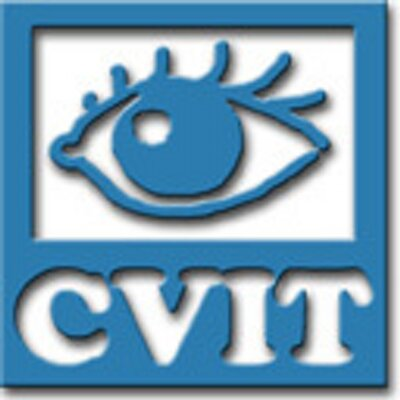
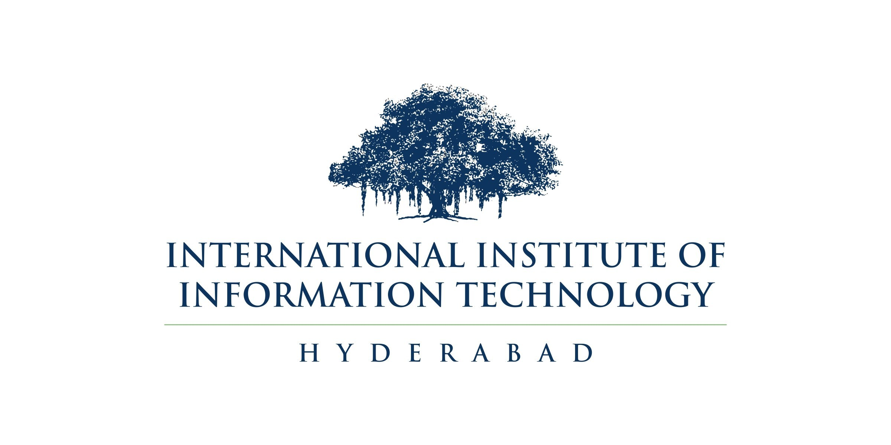

1. **Undergraduate Machine Learning Intern, Intel, June 2018 - July 2018**
	* Extensive research study on efficient semantic segmentation with a goal to devise a method for real-time segmentation for autonomous driving applications.
	* Trained latest semantic segmentation models for comparison with existing state-of-the-art models using PyTorch and Tensorflow on new datasets like Berkeley Deep Drive and Indian Driving Dataset.
	{:height="200" width="300"}
2. **Undergraduate researcher, <a href="https://cvit.iiit.ac.in">CVIT</a> at IIIT-H, May 2017 - May 2019**
	* Involved in multiple research and development projects mentored by Prof. C.V. Jawahar, ranging from an online portal for accurate annotation of videos to a full-fledged research project that resulted in a research paper.
	* Close collaboration with industry experts as well as PhD and Masters students, leading to experience in deep learning, computer vision and team-based projects.
	{:height="200" width="300"}
	{:height="200" width="400"}
3. Software Development Intern, May 2017 - August 2017